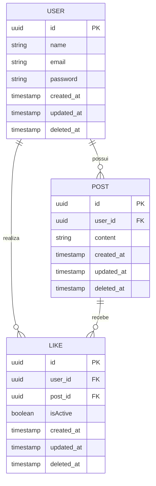

# Feed API

## Apresentação

O **Feed API** é um projeto que fornece uma API para cadastro e login de usuários, criação e listagem de posts, além de permitir interações com likes nesses posts. O objetivo é oferecer uma base robusta para aplicações sociais ou de compartilhamento de conteúdo.

## Tecnologias Utilizadas

- [NestJS](https://nestjs.com/) (Node.js)
- Docker & Docker Compose
- PostgreSQL (banco de dados relacional)
- Arquitetura baseada em DDD (Domain-Driven Design)
- Testes unitários e E2E

## Modelo de Estrutura de Dados

Abaixo está um exemplo de como ilustrar a arquitetura das tabelas do banco de dados utilizando Markdown e diagramas simples:



## Instruções para rodar o projeto

### Pré-requisitos

- Docker
- Docker Compose
- Node.js
- npm ou yarn

### Passos para rodar o projeto

1. Clone o repositório:

  ```bash
  git clone https://github.com/seu-usuario/feed-api.git
  cd feed-api
  ```

2. Instale as dependências do projeto:

  ```bash
  npm install
  # ou
  yarn install
  ```

3. Suba os containers Docker:

  ```bash
  docker-compose up -d
  ```

4. Configure as variáveis de ambiente. Crie um arquivo `.env` na raiz do projeto com as seguintes informações:

  ```env
DATABASE_HOST=
DATABASE_PORT=
DATABASE_NAME=
DATABASE_USER=
DATABASE_PASSWORD=
API_PORT=
NODE_ENV=
JWT_PRIVATE_KEY=
JWT_PUBLIC_KEY=
  ```

5. Inicie a aplicação:

  ```bash
  npm run start:dev
  # ou
  yarn start:dev
  ```

A aplicação estará disponível em `http://localhost:4568/api`.


## Documentação da API com Swagger

Este projeto utiliza o Swagger para documentar a API. O Swagger é uma ferramenta que permite visualizar e interagir com a API de forma intuitiva.

### Acessando a Documentação

1. Certifique-se de que a aplicação está rodando. Siga os passos da seção "Instruções para rodar o projeto" para iniciar a aplicação.

2. Abra seu navegador e acesse a seguinte URL:

  ```
  http://localhost:4568/api/v1
  ```

3. Documento Swagger em JSON disponível: 
  [Swagger Document](./docs/swagger/swagger.json)

4. Você verá a interface do Swagger, onde poderá visualizar todos os endpoints disponíveis na API, bem como testar as requisições diretamente pelo navegador.

### Utilizando a Documentação

- Na interface do Swagger, você verá uma lista de endpoints organizados por categorias (por exemplo, `user`, `session`, `post`).
- Clique em uma categoria para expandir e ver os endpoints disponíveis.
- Para cada endpoint, você verá informações detalhadas, como o método HTTP (GET, POST, PUT, DELETE), os parâmetros necessários, e os possíveis códigos de resposta.
- Para testar um endpoint, clique no botão "Try it out", preencha os parâmetros necessários e clique em "Execute". Você verá a resposta da API diretamente na interface do Swagger.

A documentação do Swagger facilita a compreensão e o uso da API, permitindo que você explore e teste os endpoints de maneira interativa.


## Estrutura do Projeto

- `src/`
  - `app/` - Módulo de inicialização e configuração 
  - `core/` - Módulo de pastas em comum
  - `domain/` - Módulo dos dominios do projeto
  - `infra/` - Módulo de configurações externas e banco de dados
- `test/` - configurações e padrões de testes


## Contribuição

1. Faça um fork do projeto
2. Crie uma branch para sua feature (`git checkout -b feature/nova-feature`)
3. Commit suas mudanças (`git commit -am 'Adiciona nova feature'`)
4. Faça o push para a branch (`git push origin feature/nova-feature`)
5. Crie um novo Pull Request

## Licença

Este projeto está licenciado sob a licença MIT. Veja o arquivo [LICENSE](LICENSE) para mais detalhes.

